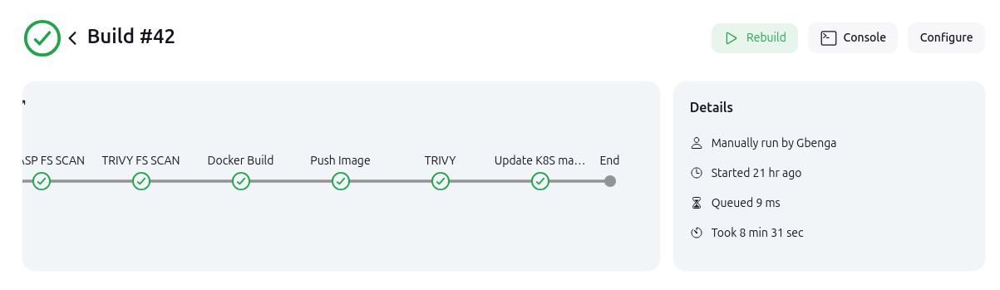

Here is the updated `README.md` incorporating **Helm** for Kubernetes deployment:

---

# Jenkins CI/CD Pipeline for GitOps with Docker, SonarQube, OWASP, Trivy, Helm, and Kubernetes


This repository contains the Jenkinsfile for automating the continuous integration (CI) and continuous deployment (CD) of a **Netflix Clone** application following GitOps practices. The pipeline leverages several key tools including Jenkins, SonarQube, OWASP Dependency Check, Trivy, Docker, Kubernetes (K8S), Helm, and ArgoCD for deployment.

## Overview

The Jenkins pipeline automates the following stages:

- **Workspace cleanup**: Ensures that the workspace is clean before starting the build.
- **Source Code Checkout**: Retrieves the latest code from the GitHub repository.
- **SonarQube Analysis**: Analyzes the code quality using SonarQube.
- **OWASP Dependency Scan**: Runs an OWASP Dependency Check for security vulnerabilities.
- **Trivy Filesystem Scan**: Scans the filesystem for vulnerabilities using Trivy.
- **Docker Build**: Builds a Docker image of the application with versioning.
- **Docker Push**: Pushes the Docker image to a Docker registry (DockerHub).
- **Trivy Docker Image Scan**: Scans the built Docker image for vulnerabilities.
- **Update Kubernetes Helm Chart**: Updates the Helm chart for deployment and pushes changes to the GitHub repository.

Additionally, this project is integrated with **ArgoCD** for Continuous Deployment (CD) and monitoring tools like **Prometheus** and **Grafana** for tracking application performance and health.

## Prerequisites

Ensure that the following tools are set up:

- **Jenkins**: For orchestrating the pipeline.
- **SonarQube**: For static code analysis and quality checks.
- **OWASP Dependency Check**: For identifying vulnerabilities in dependencies.
- **Trivy**: For container image and filesystem scanning.
- **Docker**: For building and pushing container images.
- **Kubernetes**: For deploying the application using ArgoCD.
- **Helm**: For managing Kubernetes applications through Helm charts.
- **GitHub**: For version control and storing Kubernetes manifests.
- **ArgoCD**: For deploying Kubernetes applications using GitOps principles.
- **Prometheus & Grafana**: For monitoring and observability.

## Pipeline Details



### 1. **Clean Workspace** (`clean workspace` stage)

This stage ensures that any residual files from previous builds are cleared from the workspace, preventing potential conflicts during the new build.

```groovy
stage('clean workspace') {
    steps {
        cleanWs()
    }
}
```

### 2. **Checkout Code** (`Checkout` stage)

The latest version of the code is fetched from the Git repository. The `checkout scm` step uses the GitHub integration to pull the repository.

```groovy
stage('Checkout') {
    steps {
        checkout scm
        sh "ls"
    }
}
```

### 3. **SonarQube Analysis** (`Sonarqube Analysis` stage)


This stage analyzes the codebase for quality issues using **SonarQube**. It scans the source code and reports on various quality aspects, such as code smells, bugs, vulnerabilities, and coverage.

```groovy
stage("Sonarqube Analysis") {
    environment {
        scannerHome = tool 'Sonar'
    }
    steps {
        script {
            withSonarQubeEnv('Sonar') {
                sh "${scannerHome}/bin/sonar-scanner \
                    -Dsonar.projectKey=NetFlix \
                    -Dsonar.projectName=NetFlix \
                    -Dsonar.projectVersion=1.0 \
                    -Dsonar.sources=."
            }
        }
    }
}
```

### 4. **OWASP Dependency Check** (`OWASP FS SCAN` stage)

This step runs **OWASP Dependency Check** to scan the dependencies in the project for known vulnerabilities.

```groovy
stage('OWASP FS SCAN') {
    steps {
        dependencyCheck additionalArguments: '--scan ./ --disableYarnAudit --disableNodeAudit', odcInstallation: 'DP-Check'
        dependencyCheckPublisher pattern: '**/dependency-check-report.xml'
    }
}
```

### 5. **Trivy Filesystem Scan** (`TRIVY FS SCAN` stage)

**Trivy** is used to scan the filesystem for vulnerabilities. It checks for issues in the codebase, configuration files, and dependencies.

```groovy
stage('TRIVY FS SCAN') {
    steps {
        sh "trivy --timeout 10m fs . > trivyfs.txt"
    }
}
```

### 6. **Docker Build** (`Docker Build` stage)

This stage builds a Docker image for the application. The Docker image is tagged with the build number, ensuring versioning consistency.

```groovy
stage("Docker Build") {
    environment {
        DOCKER_IMAGE = "gbengard/netflix-clone:${BUILD_NUMBER}" 
        REGISTRY_CREDENTIALS = credentials('docker-cred')
        API = credentials('TMDB')
    }
    steps {
        script {
            withDockerRegistry(credentialsId: 'docker-cred') {   
                sh "docker build --build-arg TMDB_V3_API_KEY=$API -t $DOCKER_IMAGE ."                       
            }
        }
    }
}
```

### 7. **Push Docker Image** (`Push Image` stage)


After building the Docker image, this stage pushes the image to DockerHub for later deployment.

```groovy
stage('Push Image') {
    environment {
        DOCKER_IMAGE = "gbengard/netflix-clone:${BUILD_NUMBER}"
        REGISTRY_CREDENTIALS = credentials('docker-cred')
    }
    steps {
        script {
            def dockerImage = docker.image("${DOCKER_IMAGE}")
            docker.withRegistry('https://index.docker.io/v1/', "docker-cred") {
                dockerImage.push()
            }
        }
    }
}
```

### 8. **Trivy Docker Image Scan** (`TRIVY` stage)

This step scans the built Docker image for vulnerabilities using **Trivy**. It checks for known vulnerabilities in the image layers.

```groovy
stage("TRIVY") {
    environment {
        DOCKER_IMAGE = "gbengard/netflix-clone:${BUILD_NUMBER}"
    }
    steps {
        sh "trivy image ${DOCKER_IMAGE} > trivyimage.txt"
    }
}
```

### 9. **Update Kubernetes Helm Chart & Push to Git** (`Update K8S manifest & push to Repo` stage)

This stage updates the Kubernetes deployment **Helm chart** stored in the `netflix` directory. It modifies the `values.yaml` file to reflect the new Docker image tag. The updated Helm chart is then pushed to the GitHub repository, which triggers **ArgoCD** for continuous deployment to the Kubernetes cluster.

```groovy
stage('Update K8S manifest & push to Repo') {
    environment {
        GIT_REPO_NAME = "DevSecOps-Project"
        GIT_USER_NAME = "gbengard"
    }
    steps {
        script {
            withCredentials([string(credentialsId: 'github', variable: 'GITHUB_TOKEN')]) {
                sh '''
                git config user.email "gbengardo@gmail.com"
                git config user.name "gbengard"
                BUILD_NUMBER=${BUILD_NUMBER}
                git fetch origin main
                git checkout main
                sed -i "s/tag:.*/tag: ${BUILD_NUMBER}/" netflix/values.yaml                    
                cat netflix/values.yaml
                git clean -fd
                git add netflix/values.yaml
                git commit -m "Update deployment image to version ${BUILD_NUMBER}"
                git push https://${GITHUB_TOKEN}@github.com/${GIT_USER_NAME}/${GIT_REPO_NAME} main
                '''
            }
        }
    }
}
```

## GitOps with ArgoCD


Once the Kubernetes Helm chart is updated and pushed to the Git repository, **ArgoCD** will automatically detect the changes and deploy the updated application to the Kubernetes cluster. ArgoCD monitors the repository for any changes and ensures that the deployment in Kubernetes matches the desired state defined in Git.

## Monitoring with Prometheus and Grafana


**Prometheus** is integrated into the Kubernetes cluster to collect metrics from the application. **Grafana** is used to visualize these metrics, providing insights into the application's performance, resource usage, and overall health.

## Conclusion

This pipeline automates the process of building, scanning, and deploying the **Netflix Clone** application in a secure and efficient manner, following GitOps principles. It ensures that every change is automatically tested, built, and deployed, making it easier to manage application deployments in a Kubernetes environment with ArgoCD and Helm.

